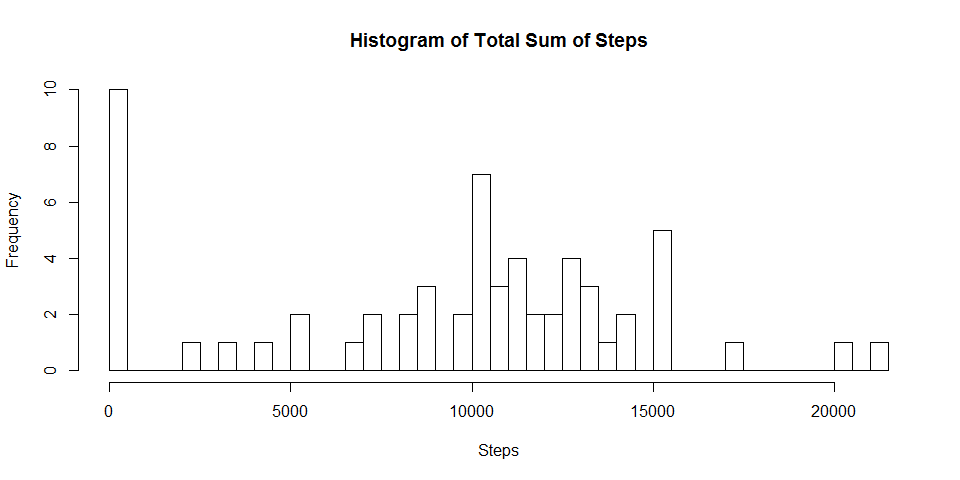
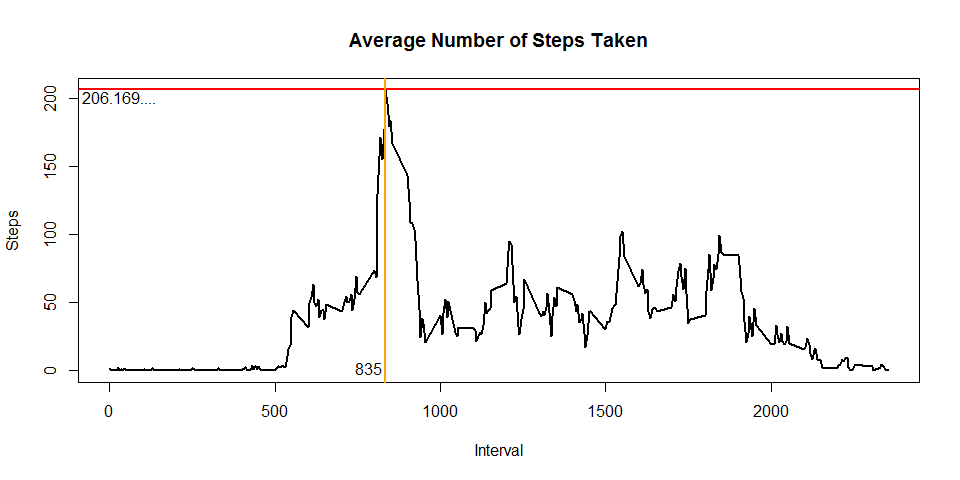
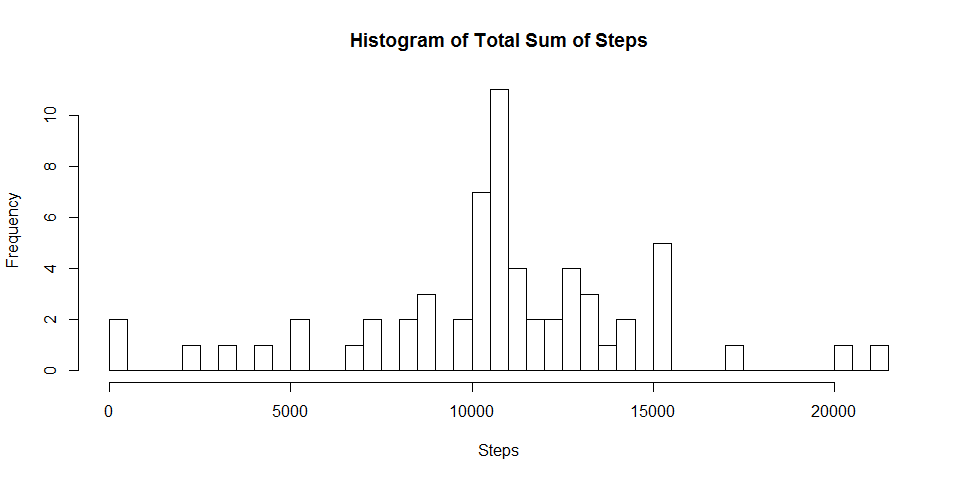
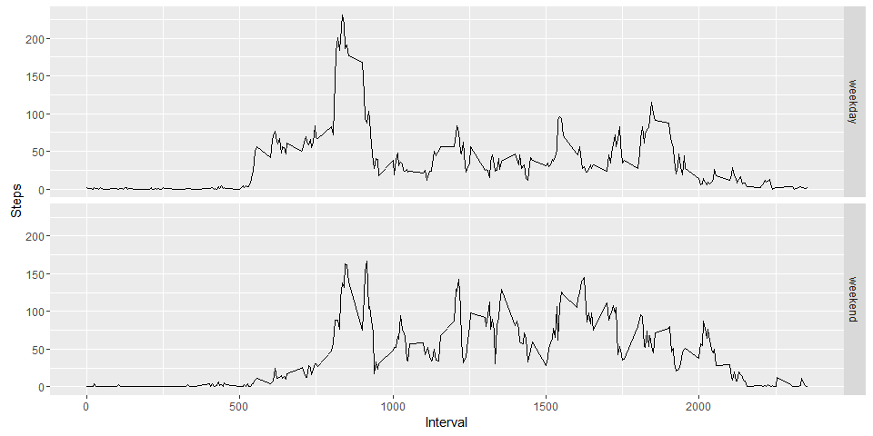

# Reproducible Research Project 1

# Overview
The goal of this project is to read in the **activity.csv** file and parse the data  

## Loading and Preprocessing Data  

```r
library(plyr)
```

```
## Warning: package 'plyr' was built under R version 3.3.1
```

```r
library(ggplot2)
```

```
## Warning: package 'ggplot2' was built under R version 3.3.1
```

```r
unzip("schematic.zip")  
data <- read.csv("activity.csv")
```

## What is mean total number of steps taken per day?

```r
# Calculate the sum of steps by date
sumsteps <- tapply(data$steps,data$date,sum, na.rm=TRUE)
mn <- mean(sumsteps)
md <- median(sumsteps)
#Plot the values
hist(sumsteps,breaks = length(sumsteps),xlab = "Steps",main = "Histogram of Total Sum of Steps")
```

<!-- -->

```r
mn
```

```
## [1] 9354.23
```

```r
md
```

```
## [1] 10395
```
This graph displays the total number of steps. As we can see from the data displayed, the mean is 9354.23 steps, while the median is 10395 steps.

## What is the average daily activity pattern?

```r
# Calculate the mean of steps taken averaged across days
#meansteps <- tapply(data$steps,data$interval,mean, na.rm=TRUE)
meandf <- ddply(data,"interval",summarise,mean = mean(steps,na.rm=TRUE))
interval <- meandf$interval[which.max(meandf$mean)]
maxval <- max(meandf$mean)
with(meandf,plot(interval,mean,lwd=2,type="l",xlab = "Interval",ylab = "Steps",main = "Average Number of Steps Taken"))
abline(h=maxval,lwd=2,col="red")
abline(v=interval,lwd=2,col="orange")
text(x=interval-50,y=2,labels = interval)
text(x=30,y=maxval-5,labels= toString(maxval,width = 11))
```

<!-- -->
This graph displays the average amount of steps taken per interval. From it, we can see that the interval with the maximum average steps is interval 835, while it's value is 206.17.  

## Imputing missing values

```r
# Number of Missing Values
sum(is.na(data$steps))
```

```
## [1] 2304
```

```r
indexes <- which(is.na(data$steps))
# My method of imputing is to replace the missing values with the average steps by interval
data.imp <- data
for (i in indexes){
  # Check which interval
  interval <- data$interval[i]
  data.imp$steps[i] <- meandf[meandf$interval==interval,2]
}

# Replot the total steps by date plot
sumsteps<- tapply(data.imp$steps,data$date,sum, na.rm=TRUE)
mn.imp <- mean(sumsteps)
md.imp <- median(sumsteps)
#Plot the graph
hist(sumsteps,breaks = length(sumsteps),xlab = "Steps",main = "Histogram of Total Sum of Steps")
```

<!-- -->

```r
mn.imp
```

```
## [1] 10766.19
```

```r
md.imp
```

```
## [1] 10766.19
```

```r
mn.imp - mn
```

```
## [1] 1411.959
```

```r
md.imp - md
```

```
## [1] 371.1887
```
The method I chose for imputting values was to replace the missing values with the average values of the interval. From this, we see an increase in both mean and median. The mean has increased by 1411.96, while the median has increased by 371.19. The most interesting fact is that mean and median are now the same value, 10766.19. 

## Are there differences in activity patterns between weekdays and weekends?

```r
# Create the factor and add it to data.imp
dates <- weekdays(as.Date(as.character(data.imp$date),"%Y-%m-%d"))
dates <- (dates == "Saturday"|dates == "Sunday")
dates <- sub(TRUE,"weekend",dates)
dates <- sub(FALSE,"weekday",dates)
dates <- factor(dates)
data.imp$weekday = dates

meandf.imp <- ddply(data.imp,c("interval","weekday"),summarise,mean = mean(steps))

# Plot
g <- ggplot(meandf.imp,aes(interval,mean))
g + facet_grid(weekday~.) + geom_line() + ylab("Steps") + xlab("Interval") 
```

<!-- -->

```r
# Find the maximum average steps and iteration taken by splitting the dataset into two data frames and then search
tmp <- split(meandf.imp,meandf.imp$weekday)
# Search through Weekday
row <- which.max(tmp[[1]]$mean)
wdinter <- tmp[[1]]$interval[row]
wdval <- tmp[[1]]$mean[row]

#Search through Weekend
row <- which.max(tmp[[2]]$mean)
weinter <- tmp[[2]]$interval[row]
weval <- tmp[[2]]$mean[row]

# Print out values
wdinter
```

```
## [1] 835
```

```r
wdval
```

```
## [1] 230.3782
```

```r
weinter
```

```
## [1] 915
```

```r
weval
```

```
## [1] 166.6392
```
From these values, we can conclude that there is a significant difference between the Weekday and Weekend. We can see that they have different patterns and different maximum average steps values. For Weekdays, the maximum is 230.38 steps, which occurs during interval 835. For Weekend, however, the maximum is 166.64 steps, which occurs during interval 915.  
